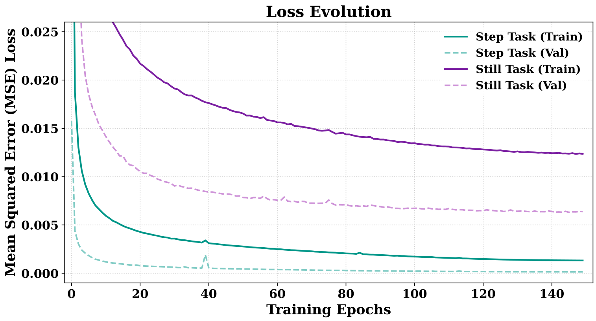
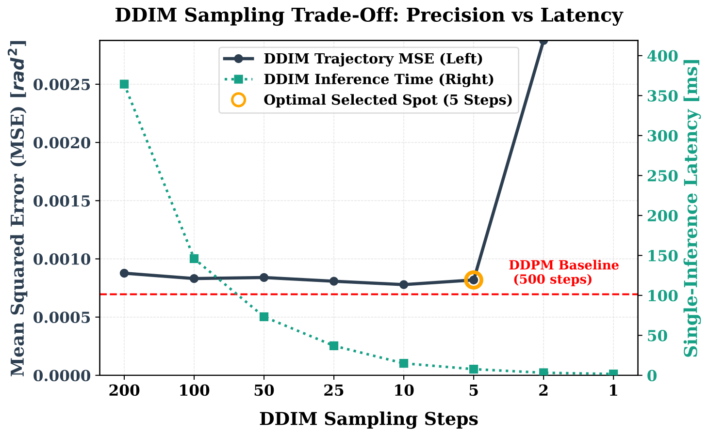
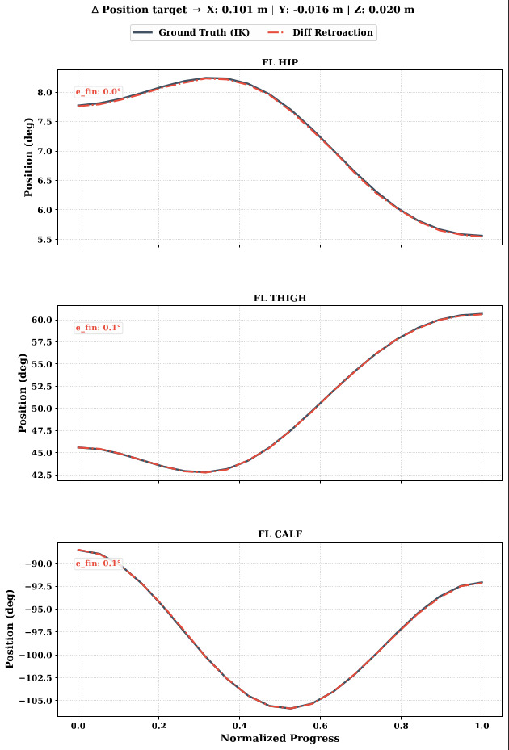
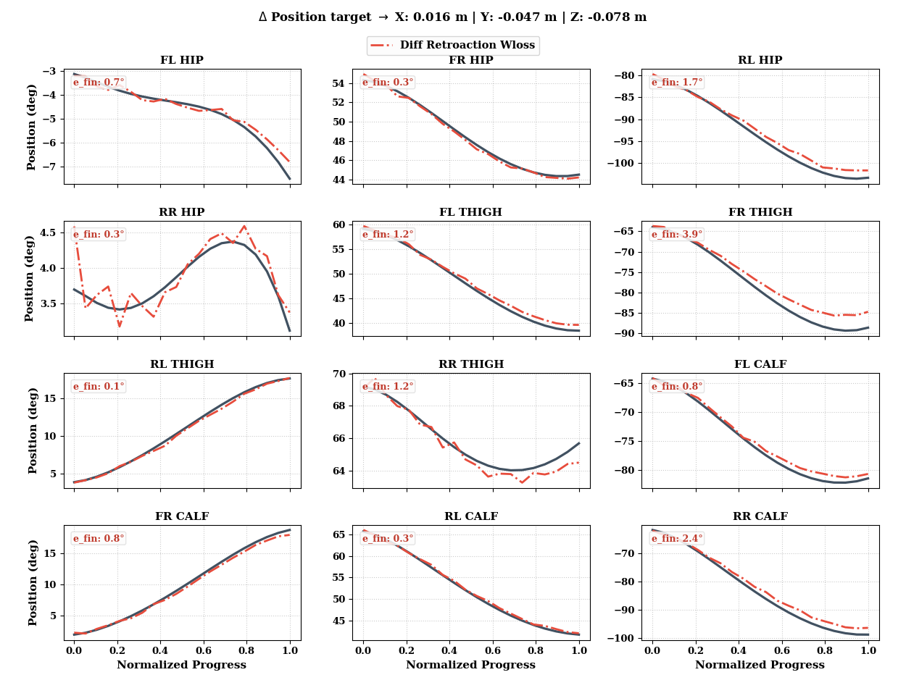

# DiffusionClimb: Generative AI for Locomotion of a Climbing Robot

This repository contains the official implementation, dataset generation pipelines, and simulation environments for the Master's Thesis: **"Generative AI for Locomotion of a Climbing Robot"** (Tosin Elia, Master MSE in Data Science, 2026).

## Project Overview

This project presents a novel generative control framework for the vertical climbing locomotion of a quadrupedal robot (**Unitree Aliengo**), shifting the traditional locomotion paradigm from reinforcement learning (RL) or optimal control (OC) to **Conditional Diffusion Models (DIFs)**. 

To overcome the challenges of active stability on vertical walls, the high-dimensional control task is decoupled into two coordinated, task-specific policies trained on expert trajectories generated offline via Inverse Kinematics (IK):
1. **Step Model:** Controls the foot swinging phase to precisely reach randomized target coordinate steps using a cycloid spatial trajectory.
2. **Still Model:** Controls the stance phase by translating and stabilizing the trunk relative to anchored feet, implementing a **"Virtual Treadmill Effect"** in the local reference frame.

The system is validated end-to-end within **NVIDIA Isaac Sim**, where the robot successfully performs closed-loop vertical climbing utilizing reoriented gravity and simulated vacuum-suction contact models.

---

## Technical Architecture

### 1. Decoupled Locomotion Control
- **Step Model (Swing):** Independently randomizes foot positions and target commands. Trajectories are interpolated via cyclic parametric equations (H=0.05m) and resolved through a robust Damped Least-Squares (DLS) Inverse Kinematics formulation.
- **Still Model (Stance):** Solves body progression by framing each stance leg as an inverted 3-DoF manipulator. Smooth trunk spatial translations and orientation profiles are generated via a locked Clamped Cubic Spline with zero-velocity boundary conditions.

### 2. Neural Architecture (Wrapper vs. Engine)
To isolate diffusion scheduling from neural predictions, the pipeline utilizes a modular design:
- **`GaussianDiffusion` (Wrapper):** Task-agnostic class managing DDPM and deterministic DDIM noise schedules.
- **`ConditionalDropOutDiffusionModel` (Core Engine):** Multi-input MLP neural network consisting of:
  - Sinusoidal positional embeddings for diffusion timesteps.
  - Linear projection layers mapping heterogeneous state inputs to a shared 512-dimensional latent space.
  - 4 residual blocks with skip connections and dropout (0.1).
  - Task-specific closed-loop conditioning vectors incorporating proprioceptive history (past joint states and previous actions).

### 3. Hyperparameters & Training
- **Dataset size:** 2,000,000 trajectories per task saved in the highly efficient **Zarr** storage format.
- **Optimizer:** AdamW with Cosine Annealing learning rate scheduler over 150 epochs.
- **Inference Optimization:** Deterministic **DDIM with 5 steps** is selected as the optimal trade-off spot, accelerating inference latency to **7.69 ms (~130.0 Hz)** with negligible loss of accuracy, and running at a VRAM footprint below **300 MB** for dual co-execution.

---

## Simulation & Media (GIFs / Videos)

*This section is reserved for visual demonstrations of the climbing robot's gait, transitions, and performance plots*

### 🎥 Simulation Recordings
*Below are the GIF animations displaying the robot vertical climbing execution in Isaac Sim:*

#### 1. Step Execution (Close-up view of the foot swing trajectory)
[](https://www.youtube.com/watch?v=AXn0P3tMuZM)

#### 2. Planar View (Top-down alignment and lateral stability)
[](https://www.youtube.com/watch?v=8a1du7Nt30g)

#### 3. Isometric View (Overall progression and climbing performance)
[](https://www.youtube.com/watch?v=EX0Lxk-caRs)
---

### 📊 Performance Plots
*Below are the diagnostic figures illustrating model training convergence, precision benchmarking, and the DDIM trade-off analysis:*

#### 1. Loss Evolution (MSE convergence over 150 epochs)


#### 2. DDIM Sampling Trade-Off (Precision vs. Computational Latency)


#### 3. Step Model Joint Tracking Predictions (Ground Truth vs. Diffusion Model)


#### 4. Still Model Joint Tracking Predictions (Ground Truth vs. Diffusion Model)


---

## Repository Structure

```text
DiffusionClimb/
├── config/             # Hyperparameter profiles and environment parameters
├── datasets/           # Dataset generation scripts and Zarr integration
├── models/             # PyTorch code for GaussianDiffusion wrapper & MLP engine
├── simulation/         # Isaac Sim setup scripts, gravity, and D6 constraint models
├── utils/              # Inverse Kinematics (Pinocchio) and spline algorithms
├── main_inference.py   # Closed-loop automated state machine runner
└── README.md           # This project guide
```
